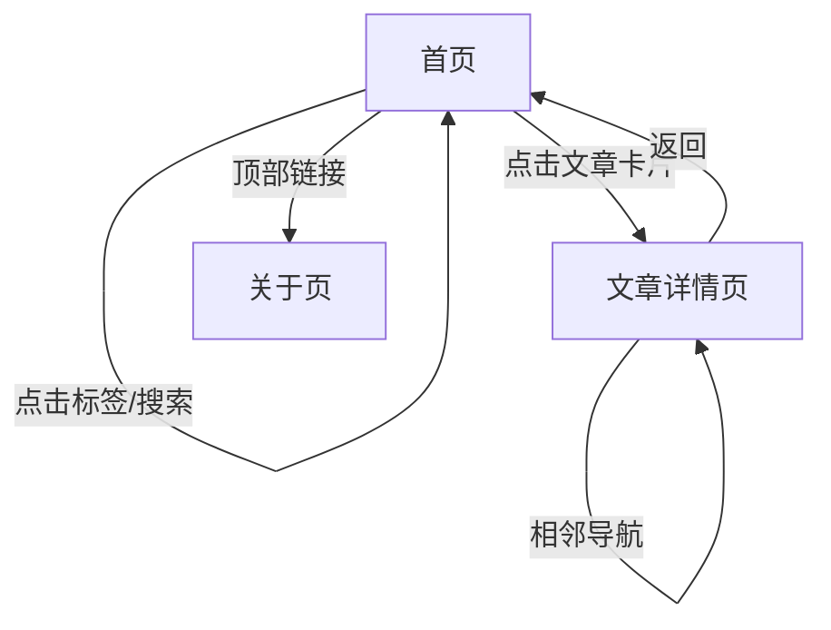

## 1. 产品概述
一款基于 Next.js App Router 的个人博客，支持 Markdown 写作、标签过滤、快速响应的现代化阅读体验。帮助作者专注内容创作，读者高效发现文章。

## 2. 核心功能

### 2.1 用户角色（本阶段仅「访客」）
| 角色 | 注册方式 | 核心权限 |
| ---- | -------- | -------- |
| 访客 | 无需注册 | 浏览文章、按标签筛选、搜索、RSS 订阅 |

### 2.2 功能模块
博客由以下 3 个页面构成：
1. **首页**：文章列表、标签筛选、搜索、RSS 入口。
2. **文章详情页**：Markdown 渲染、标签展示、相邻文章导航。
3. **关于页**：个人简介、社交链接、版权信息。

### 2.3 页面详情
| 页面名称 | 模块名称 | 功能描述 |
| -------- | -------- | -------- |
| 首页 | Hero 区域 | 展示博客标题与一句话介绍 |
| 首页 | 标签栏 | 点击标签即时过滤文章；支持多选交集 |
| 首页 | 搜索框 | 实时模糊搜索标题与摘要 |
| 首页 | 文章卡片 | 封面图、标题、摘要、发布时间、阅读时长、标签列表 |
| 首页 | 分页/加载更多 | 无限滚动或「加载更多」按钮，每页 10 篇 |
| 首页 | RSS 图标 | 生成 `/rss.xml` 供订阅 |
| 文章详情页 | Markdown 渲染 | 支持代码高亮、Table、GitHub Alert 语法 |
| 文章详情页 | 标签展示 | 文末统一展示标签，可点击回首页并自动选中该标签 |
| 文章详情页 | 相邻导航 | 上一篇 / 下一篇标题链接 |
| 关于页 | 头像+简介 | 圆形头像、Markdown 简介、社交图标 |

## 3. 核心流程
访客打开首页 → 浏览最新文章 → 点击标签或搜索缩小范围 → 进入文章详情阅读 → 通过底部导航返回或跳转到相邻文章 → 随时通过顶部「关于」了解作者。

## 4. 用户界面设计

### 4.1 设计基调
- 主色：#111827（深灰黑）
- 辅色：#3b82f6（亮蓝）
- 按钮：圆角 6px，hover 微阴影
- 字体：Inter 变量，正文字号 16px，标题 32/24/20 三级阶梯
- 布局：顶部通栏导航 + 主内容区最大 768px 居中卡片
- 图标：统一使用 Heroicons 线性风格

### 4.2 页面快速一览
| 页面名称 | 模块名称 | UI 元素 |
| -------- | -------- | -------- |
| 首页 | 文章卡片 | 封面 16:9 圆角 8px，标题 20px 加粗，摘要 16px 灰色，标签 12px 圆角蓝底白字 |
| 文章详情 | Markdown 正文 | 代码块使用 prism-dark 主题，行号显示，表格隔行变色，引用左侧 4px 蓝条 |
| 关于页 | 头像 | 128px 圆形，下方 24px 加粗昵称，再下方社交图标 32px 灰蓝渐变 |

### 4.3 响应式策略
桌面优先，768px 以下切换为移动布局：
- 导航栏变汉堡菜单
- 文章卡片由双列变单列
- 字体缩小 1–2px，代码块横向滚动

### 4.4 3D 场景指导
无 3D 内容，本项省略。