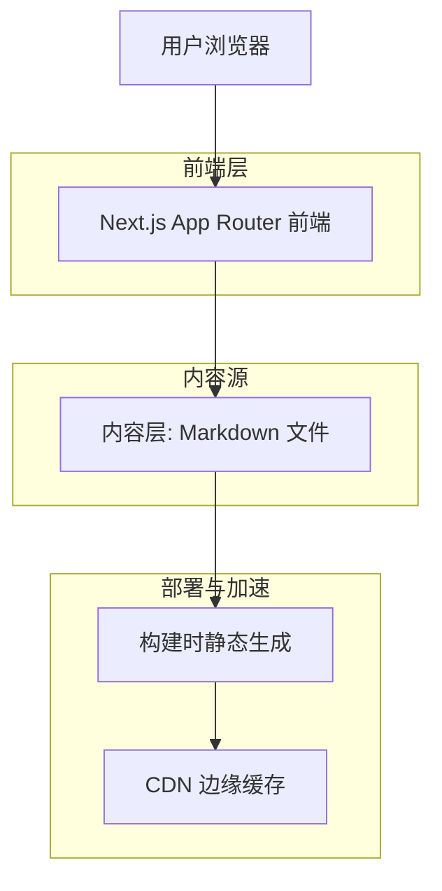
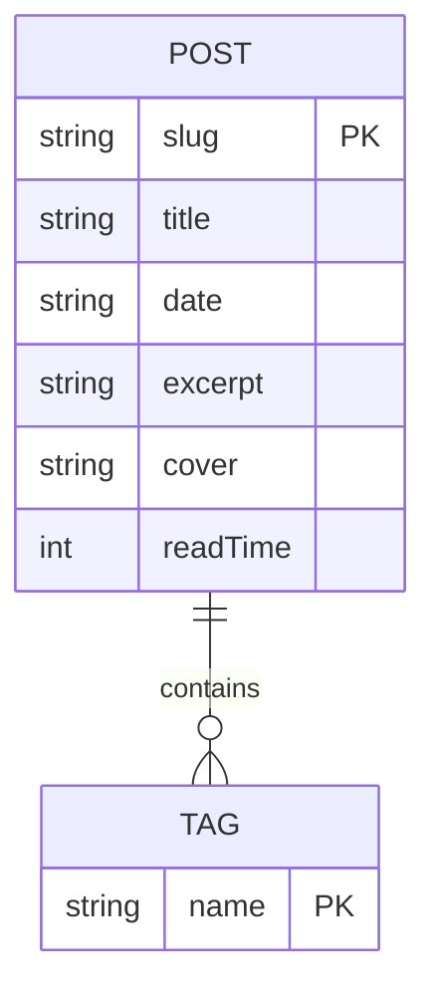

## 1. 架构设计



## 2. 技术描述

* 前端：Next.js\@15 (App Router) + React\@18 + TypeScript

* 样式：Tailwind CSS\@3

* Markdown 引擎：remark + rehype + shiki（代码高亮）

* 初始化工具：官方 `create-next-app@latest`（默认集成 Turbopack 开发服务器）

* 数据：本地 `/posts/*.md` 文件 + front-matter YAML，构建时读取

* 部署：Vercel 零配置推送，自动 HTTPS & 全球 CDN

## 3. 路由定义

| 路由              | 用途                 |
| --------------- | ------------------ |
| `/`             | 首页，列表+筛选           |
| `/posts/[slug]` | 文章详情，动态静态生成        |
| `/about`        | 关于作者               |
| `/rss.xml`      | RSS 2.0 订阅输出       |
| `/tags/[tag]`   | 标签过滤页（可选，可用查询参数简化） |

## 4. API 定义（仅构建时 Node 脚本，无运行时 API）

### 4.1 内容读取工具函数

```ts
// lib/posts.ts
export async function getSortedPosts(): Promise<PostMeta[]>
export async function getPostBySlug(slug: string): Promise<Post>
export async function getAllTags(): Promise<string[]>
```

Type 定义：

```ts
type PostMeta = {
  slug: string
  title: string
  date: string
  excerpt: string
  tags: string[]
  cover?: string
  readTime: number
}
```

## 5. 服务器架构图

纯静态生成，无运行时服务器，故省略。

## 6. 数据模型

### 6.1 模型关系



### 6.2 内容文件约定

文件路径：`/posts/YYYY-MM-DD-my-post-title.md`
front-matter 示例：

```yaml
---
title: "使用 Next.js 15 构建极速博客"
date: "2026-03-26"
tags: [Next.js, Markdown, Performance]
cover: "/images/cover.jpg"
---
```

> 说明：无需数据库；如需后续扩展为 CMS，可无缝迁移至 Supabase/ContentLayer。

